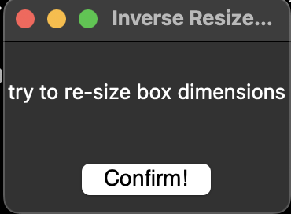

## GUI Assignment

for my gui i wanted to make a window that gets smaller when you try to make it bigger, and gets bigger when you try to make it smaller. i wrote the code for this, but when i actually try to use it it crashes, which is still annoying gui, but not what i was going for 

[link to code](https://github.com/lethinix/cc-python2.2/blob/main/GUI/assignment.py)