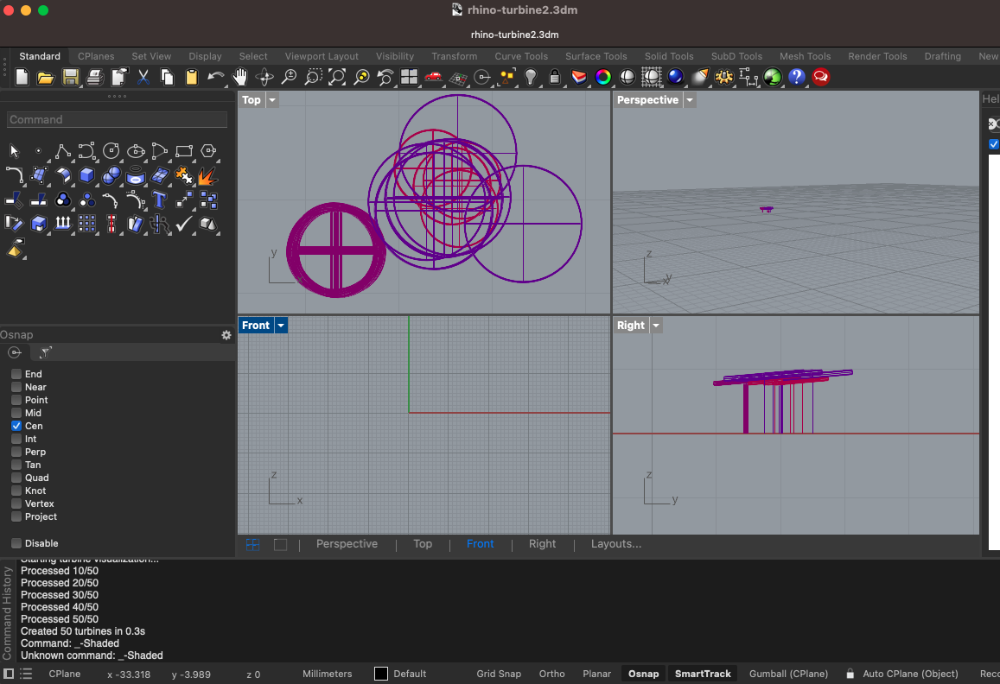

## Final Project

My final project is a wind turbine data visualization. This project uses data I exported from the USGS website, which provides public access to national wind turbine data. I then cleaned the data in another python file to pull only the data points i wanted, which included tower hight, rotor diameter, power output, logitude, and lattitude. Then I saved that csv file, and worked with it though the python scripting platform in Rhino, which is 3D modeling software. I wrote code in Rhino's scripting platform to visualize the dimensions, location, and power output for 50 wind turbines in Iowa. It's a very simple visualization because I had to majorly scale down because my computer couldn't handle the more turbines + more details. 

[link to code](https://github.com/lethinix/cc-python2.2/blob/main/final-project/turbines.py)