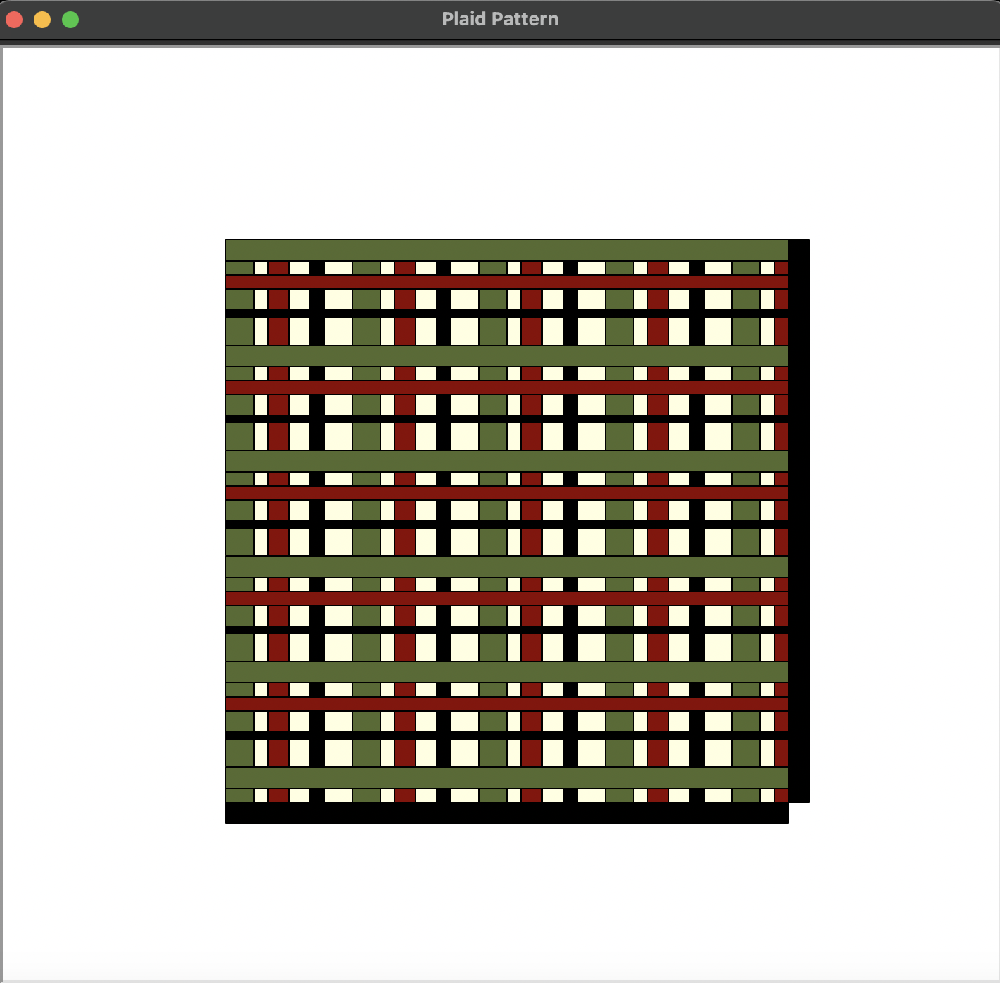

### plaid pattern

I used turtle to create create a plaid pattern by going through a series of layered horizontal and vertical stripes. 

[code](https://github.com/lethinix/cc-python2.2/blob/main/turtle/assignment-4)